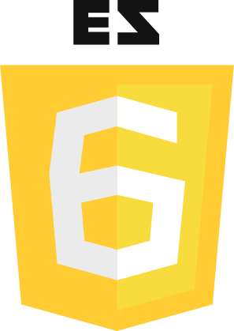
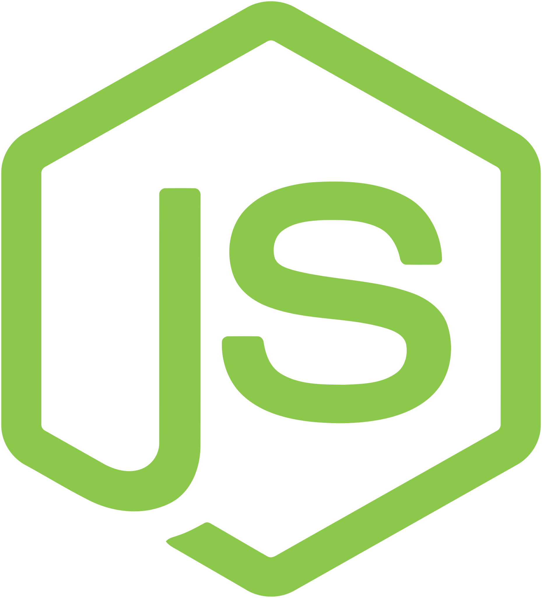
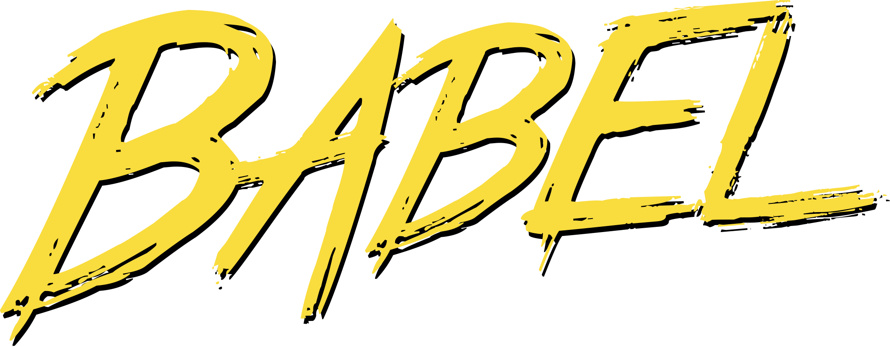

# <a name="aden"></a> Aden
> Automated Server for the Web.

- [Introduction](#introduction)
  - [Technology](#technology)
- [Getting Started](#gettingstarted)
  - [Scripting](#scripting)
  - [Styling](#styling)
  - [Application](#application)
  - [Modules](#modules)
  - [API](#api)
  - [Build](#build)
  - [Deploy](#deploy)
  - [Scale](#scale)
- [Attitudes (Plugins/Extensions)](#attitudes)
  - [JS (Babel)](/attitudes/js.html)
  - [Vendor](/attitudes/vendor.html)
- [TL;DR](#tldr)
- [Listing](#listing)


## <a name="introduction"></a> Introduction
Hi, I am Aden. I give you a CLI to handle a web application or service. I can help you develop and deploy static and dynamic sites or a full featured web application.

<div id="supportedOS">
  Supports:
  <i class="fa fa-apple" aria-hidden="true"></i>
  <i class="fa fa-linux" aria-hidden="true"></i>
  <i class="fa fa-windows" aria-hidden="true"></i>
</div>

<div id="npmBanner">
  [](https://nodei.co/npm/aden/)
</div>

You can check what my CLI can do for you at any time with `aden -h`.

_Note_: Help us get out of alpha stage, by providing feedback. If you want to get the newest development version, clone my repository and do `npm i -g` from there.

If I bug you with an error at any point, or you have an idea how I may help you better,
feel free to [open an issue](https://github.com/kommander/aden/issues/new).

<div class="section-menu">
  [<i class="fa fa-arrow-circle-up" aria-hidden="true"></i> Back to the top.](#aden)
</div>

### <a name="technology"></a> Technology
Standing on the shoulders of giants, I leverage a set of modern open source technologies like [Webpack](https://github.com/webpack/webpack), [Babel](https://babeljs.io/) and [Express](http://expressjs.com/) to deliver on my promises.
Although you do not need to know about any of these in detail to get started, I strongly encourage you to read up on the technologies involved.

<div class="container">
  <div class="icon">
    
    <div class="overlay">
      <div class="text">I am pre-configured to support ECMAScript 6. No need to set up transpilers.</div>
    </div>
  </div>

  <div class="icon">
    
    <div class="overlay">
      <div class="text">I am built on Nodejs and automate routing setup with Express.</div>
    </div>
  </div>

  <div class="icon">
    
    <div class="overlay">
      <div class="text">I come with pre-configured babel transpilers and polyfills. You retain full control though.</div>
    </div>
  </div>

  <div class="icon">
    
    <div class="overlay">
      <div class="text">I aim to distill webpacks wall of configuration into an intuitive automated system.</div>
    </div>
  </div>
</div>

<div class="section-menu">
  [<i class="fa fa-arrow-circle-up" aria-hidden="true"></i> Back to the top.](#aden)
</div>

## <a name="gettingstarted"></a> Getting Started
Remember, back in the 90s when my [big brother](http://httpd.apache.org/docs/2.4/) was serving the web?
Those were amazing times. Lets start with what he could do. But dynamic by nature.

Open a Terminal. Create a project _root folder_ `mkdir woa` and navigate to it `cd woa`. There, `touch .server`.
Now I can help you out developing with `aden dev`.

As you might have noticed, I am now running on port `5000`, with `./woa` as your _root folder_.
Just open your browser and navigate to `http://localhost:5000`.

You should get a `404` page, because there's nothing to show yet. Let's create our first content and see what happens.

```bash
echo "<h1>Hello Web</h1>" > index.html
```

Your Browser should greet you with `Hello Web`.

<div class="section-menu">
  [<i class="fa fa-arrow-circle-up" aria-hidden="true"></i> Back to the top.](#aden)
</div>


### <a name="scripting"></a> Scripting
Now, that can be done with any static file server. Let's see if you like this:

```bash
echo "alert('woa')" > index.js
```

Check your browser. I just _injected the script_ into your html. You can wrap your html in a layout by using a template engine like [handlebars](/attitudes/hbs.html) or the [default layout attitude](/attitudes/layout.html).

<div class="section-menu">
  [<i class="fa fa-arrow-circle-up" aria-hidden="true"></i> Back to the top.](#aden)
</div>


### <a name="styling"></a> Styling
As you might have guessed by now, I can also _inject stylesheets_ for you. Try it like this.

```bash
echo "h1 { color: #15425F; }" > index.css
```

Your browser should have updated to our stylesheet by now.
But we are still getting that _alert_, so lets remove that again `rm index.js`.

Better. We just created a page, that could be deployed as is. I will take care of optimizing your _bundles_ and _entry points_ for fast delivery.

<div class="section-menu">
  [<i class="fa fa-arrow-circle-up" aria-hidden="true"></i> Back to the top.](#aden)
</div>


### <a name="application"></a> Application
That one page would be pretty lonely though. Lets get started with our first app.

<div id="quotemachine">
  <blockquote>
    <i class="fa fa-quote-left" aria-hidden="true"></i><span id="quote"></span>
    <p id="author"></p>
    <a id="origin" href="#"></a>
  </blockquote>
  <button id="quoteButton" class="btn btn-primary">Get another quote</button>
</div>

I like quotes. Let's build a random quote machine!

First, we need a script that gives us a random quote. Create a new folder `mkdir quotemachine`, navigate to it `cd quotemachine` and setup an html entry point with

```bash
echo "<h1>QuoteMachine</h1>" > index.html`
```

Now add back _javascript_ with `touch quote.js`. Open your favorite editor and fill it with:

```js
const quotes = [
  '...',
  '...',
];

module.exports = function getRandomQuote() {
  const index = Math.floor(Math.random() * ((quotes.length - 1) + 1));
  return quotes[index];
};
```

I just setup the `/quotemachine` route for you. Navigate your browser to `http://localhost:5000/quotemachine`. Nothing happens yet. To add this module to our application, we need to require it from our _entry point_. `touch index.js`, open it in your editor and type:

```js
const quote = require('./quote');
alert(quote());
```

Ok, that works. Lets render our quote to the page now, instead of alerting the user. Add a `<blockquote id="quote"></blockquote>` to our `index.html` and adjust our _entry point_ script like so:

```js
const quote = require('./quote');
const quoteElement = document.querySelector('#quote');
quoteElement.innerText = quote();
```

Lets add a button to refresh the quote. After our _blockquote_, add `<button id="quoteButton">Get another quote</button>`. From our _entry point_ script we can now do:

```js
const quote = require('./quote');
const quoteElement = document.querySelector('#quote');
const quoteButton = document.querySelector('#quoteButton');
quoteButton.addEventListener('click', () => (quoteElement.innerText = quote()));
```

Clicking the newly added button on the page should result in the next random quote shown on the page.

<div class="section-menu">
  [<i class="fa fa-arrow-circle-up" aria-hidden="true"></i> Back to the top.](#aden)
</div>


### <a name="modules"></a> Modules
Looks a bit 90s though, lets add some styling. I heard [bootstrap](http://getbootstrap.com/) gives you a good head-start and is widely used. To be able to add modules to our project we need to initialize npm with `npm init --yes`, then we can add bootstrap via `npm i bootstrap`. Create an _entry style_ `touch index.css` and just put `@import "~bootstrap/dist/css/bootstrap.min.css";` at the very top.

Add `class="btn btn-primary"` to our button element.

Check our app. Looks better. Should do for now.

<div class="section-menu">
  [<i class="fa fa-arrow-circle-up" aria-hidden="true"></i> Back to the top.](#aden)
</div>


### <a name="api"></a> API
If you want to get your quotes from an API, rather than delivering thousands of them with every request, I can help you out as well.

Lets move our `getRandomQuote` method to the server, by creating a _route_ for our API with `mkdir -p api/quote`. Move our `quote.js` there `mv quote.js api/quote/quote.js`.

In that route we `touch api/quote/.get.js`. If you give me a wrapped method from that file, I will setup a get controller for you. Open `.get.js` and add:

```js
const quote = require('./quote');
module.exports = () => (req, res) => res.send(quote());
```

Lets check if our new endpoint works as expected by navigating to `http://localhost:5000/quotemachine/api/quote`.

So we can request our quote from the server now, rather than delivering all quotes with our frontend application bundle.

Change our `quotemachine/index.js` to the following:

```js
const quoteElement = document.querySelector('#quote');
const quoteButton = document.querySelector('#quoteButton');
quoteButton.addEventListener('click', () =>
  fetch('/quotemachine/api/quote')
    .then((res) => res.text())
    .then((text) => (
      quoteElement.innerText = text
    ))
);
```

All quotes are now produced by our first API endpoint.

We can now link our _QuoteMachine_ as a project from our _root_,
just add `<a href="/quotemachine">QuoteMachine</a>` to our _root index.html_.

By the way, you might have noticed, we are using ES6 syntax, like _arrow functions_.
This works out of the box, as I have Babel with an `es2015` and `env` preset on-board.
You can adjust Babel by creating a `.babelrc` file in your _root folder_.

<div class="section-menu">
  [<i class="fa fa-arrow-circle-up" aria-hidden="true"></i> Back to the top.](#aden)
</div>


### <a name="build"></a> Build
If you want to take our application to production, we need a production build. I can do that for you, after you stop the development server, with `aden build`. The resulting development build in `.dist` can be moved to a production environment. It contains all _dynamic templates_. _Static output_ can be found in `.dist/public`.

Additionally to the dynamic templates and static content, I also generate a `pages.json` where all the routing and configuration information (Page Graph) is stored, so I can run the application without having to parse the file tree again, for super fast startup in production.

You can start the production build by executing `aden start` in the _root_ of your application or by pointing aden to it from anywhere with `aden start /path/to/myapp`.

<div class="section-menu">
  [<i class="fa fa-arrow-circle-up" aria-hidden="true"></i> Back to the top.](#aden)
</div>


### <a name="deploy"></a> Deploy
If you only built _static assets_, you can use the output in the `.dist/public` folder and serve via your CDN or a static application hosting service like [Surge.sh](http://surge.sh) or [Github Pages](https://pages.github.com/).

Your _dynamic entry points_ I can run as a standalone server and serve your app when asked to, as you have seen with a global install `npm i -g aden`. I can also serve as a package dependency in your project, from where you can leverage my full CLI via _npm scripts_. Or use me as a library to extend an existing express application.

So I am able to comply with a variety of Node.js hosting services, like [Heroku](https://heroku.com). Check out [my repository](https://github.com/kommander/aden), where this documentation is ran from.

<div class="section-menu">
  [<i class="fa fa-arrow-circle-up" aria-hidden="true"></i> Back to the top.](#aden)
</div>


### <a name="scale"></a> Scale
I can become overloaded with _dynamic entry and API endpoints_, that might need additional server resources.

Lets scale our _QuoteMachine_ to four workers with `aden start -w 4`. I should be running with four worker processes now.

If you want to have another instance with four workers, focusing on the API endpoint, I can do that for you with

```bash
aden start -w 4 --focus quotemachine/api/quote -p 5001
```

I now serve the `quote` endpoint only, at `http://localhost:5001/quotemachine/api/quote`. Other entry points like `http://localhost:5001/` will not be mounted on this instance.


I hope this helps your operations. That's all for now. If you want to know more, check out [my source](https://github.com/kommander/aden), I'll be glad to follow up on your [issues](https://github.com/kommander/aden/issues/new) and feel free to [create a PR](https://github.com/kommander/aden/pulls).

<div class="section-menu">
  [<i class="fa fa-arrow-circle-up" aria-hidden="true"></i> Back to the top.](#aden)
</div>


## <a name="attitudes"></a> Attitudes
I come with [attitudes](/attitudes) to build and serve your application, based on some default [Webpack plugins and loaders](https://github.com/webpack-contrib/awesome-webpack). You can adjust and/or extend the generated Webpack configuration at any time, via the `.server` file. Whenever you need an additional loader, you can add it like:

```js
// .server.js
module.exports = {
  webpack: {
    rules: [
      { test: /\.ext?$/, loader: 'another-loader' },
    ],
  }
}
```

I will add the correct _include paths_ to your loader. I suggest you rather give me a new attitude to handle a file type. Have a look at my [default attitudes](https://github.com/kommander/aden/tree/master/attitudes) on how to do that.

> I am not a hammer, I am a Nailgun. I shoot whatever I am loaded with. Be careful, my attitudes might hit your foot.

<div class="section-menu">
  [<i class="fa fa-arrow-circle-up" aria-hidden="true"></i> Back to the top.](#aden)
</div>


## <a name="tldr"></a> TL;DR
`npm i aden -g` => `touch .server` => `aden dev` => use filesystem like a webserver of the days of olde (with all modern web-dev goodies).

<div class="section-menu">
  [<i class="fa fa-arrow-circle-up" aria-hidden="true"></i> Back to the top.](#aden)
</div>

## <a name="listing"></a> Listing
You can find the example _QuoteMachine_ code in my repo, where these docs are located. My maintainers are also working on [a more advanced documentation](/advanced.html) (work in progress).

<div class="section-menu">
  [<i class="fa fa-arrow-circle-up" aria-hidden="true"></i> Back to the top.](#aden)
</div>
